# 🚀 RapidSplit — A Rapido Clone, But Smarter!

RapidSplit is inspired by Rapido. This app lets users book a ride with ease, but here's the twist: you can also split the fare with friends using the built-in FuelSplit feature.

Perfect for the times when you're riding with buddies and nobody wants to do the math!

---

## 🎯 Key Features

* 🚀 Smooth booking flow (source → destination → vehicle type)
* 📍 Estimate fare & duration instantly
* 💳 Multiple payment options (Cash, UPI, Paytm)
* 👥 FuelSplit — Split the ride cost with friends
* 🧾 View your split history, thanks to Room DB
* ✨ Clean, Material 3 UI powered by Jetpack Compose

---

## 🛠 Tech Stack

| Layer        | Tools/Libraries             |
| ------------ | --------------------------- |
| UI           | Jetpack Compose, Material 3 |
| Architecture | MVVM + Clean Architecture   |
| State Mgmt   | State, StateFlow            |
| Async Ops    | Kotlin Coroutines           |
| DI           | Koin                        |
| DB           | Room                        |
| Navigation   | Compose Navigation          |

---

## 📸 Screenshots

<table>
  <tr>
    <td>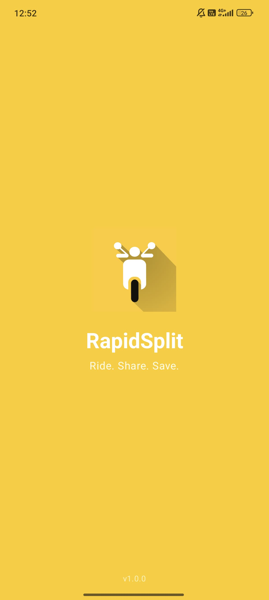</td>
    <td>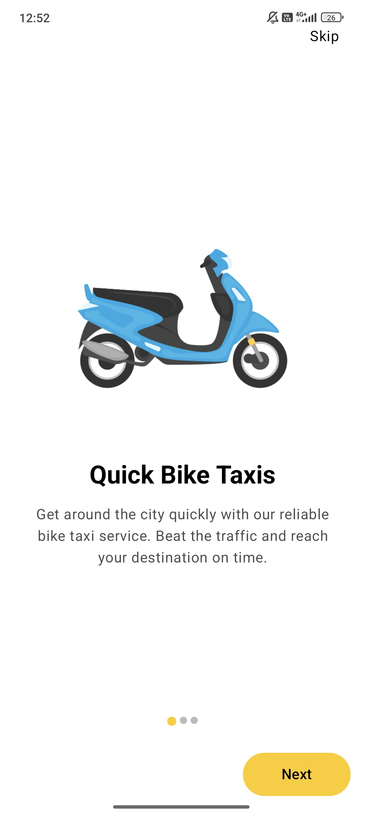</td>
  </tr>
  <tr>
    <td>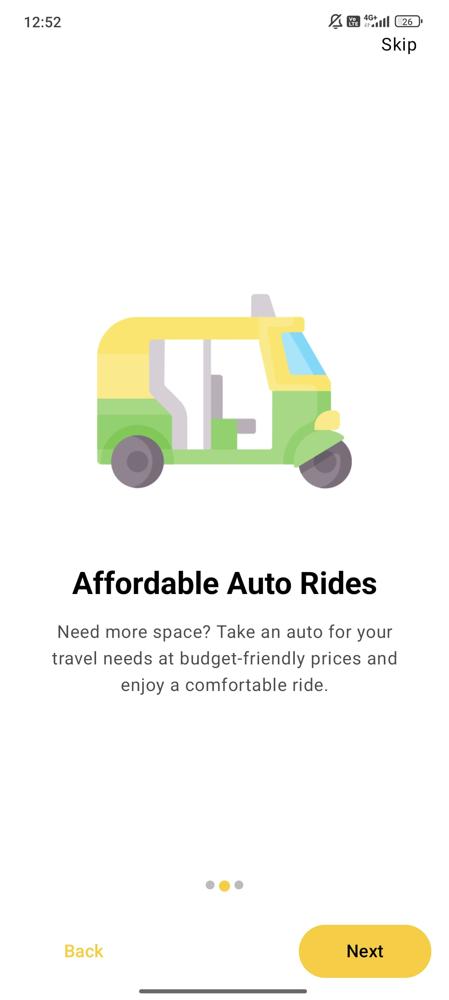</td>
    <td>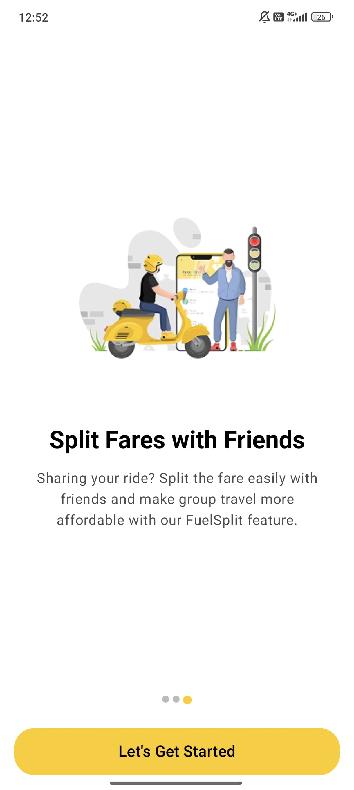</td>
  </tr>
  <tr>
    <td>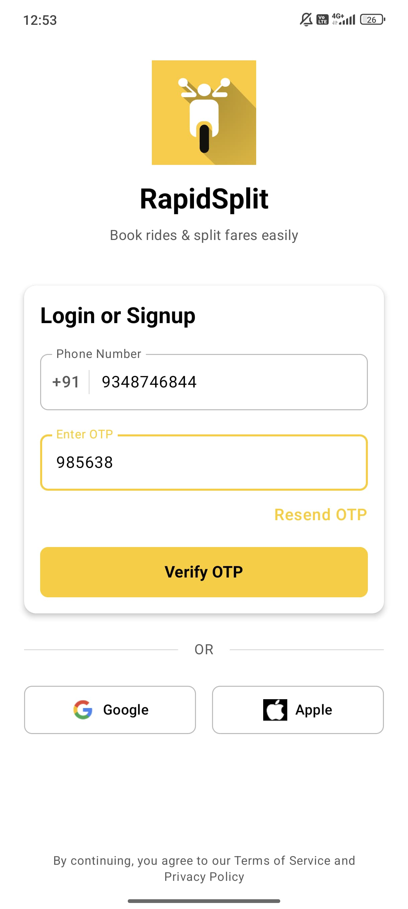</td>
    <td>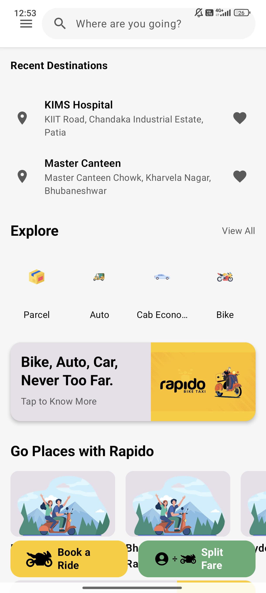</td>
  </tr>
  <tr>
    <td>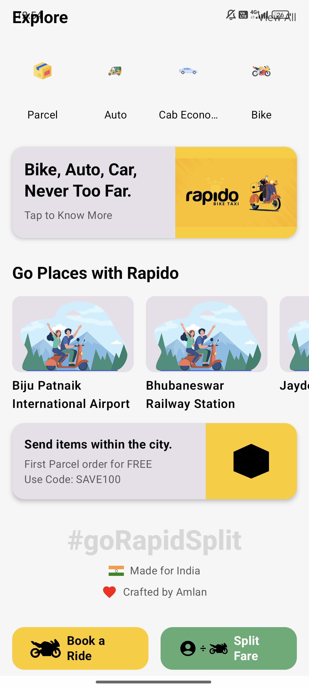</td>
    <td>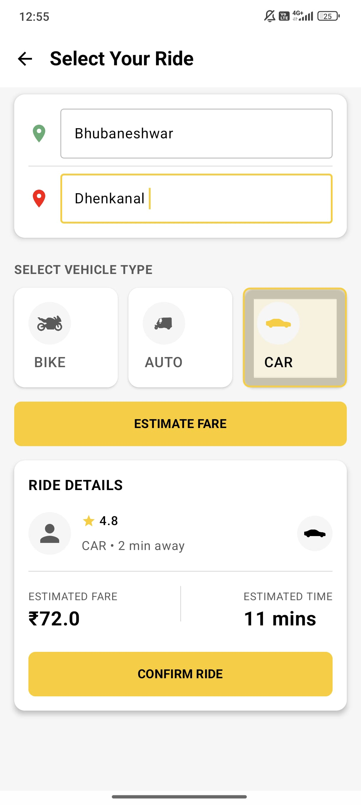</td>
  </tr>
  <tr>
    <td>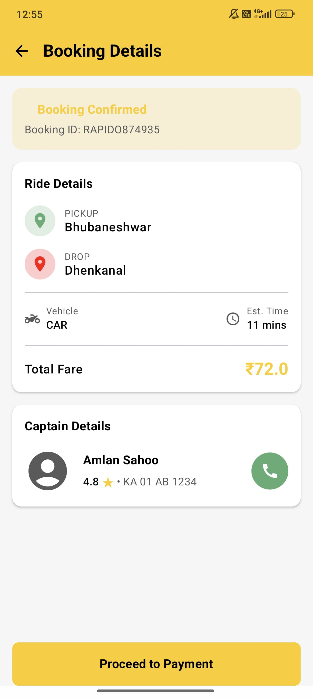</td>
    <td>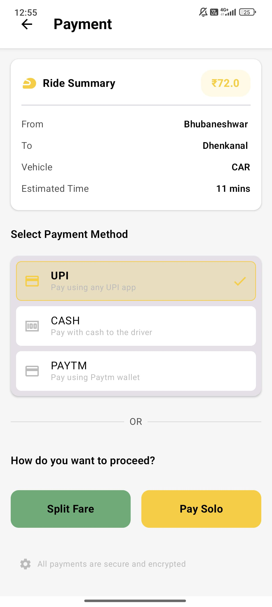</td>
  </tr>
  <tr>
    <td>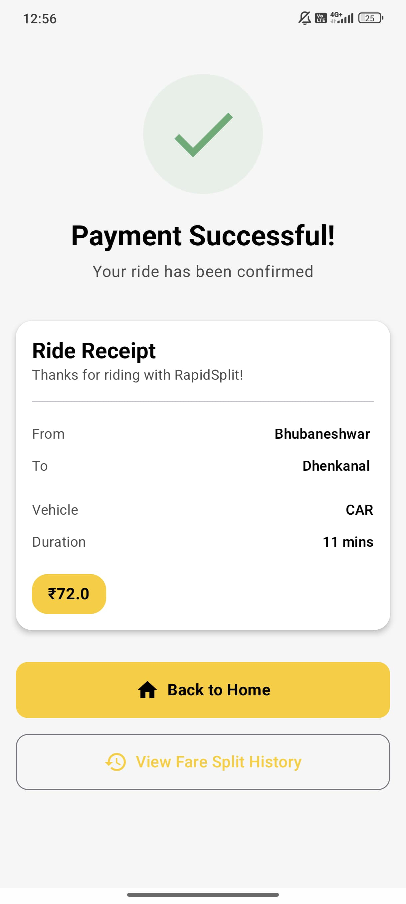</td>
    <td>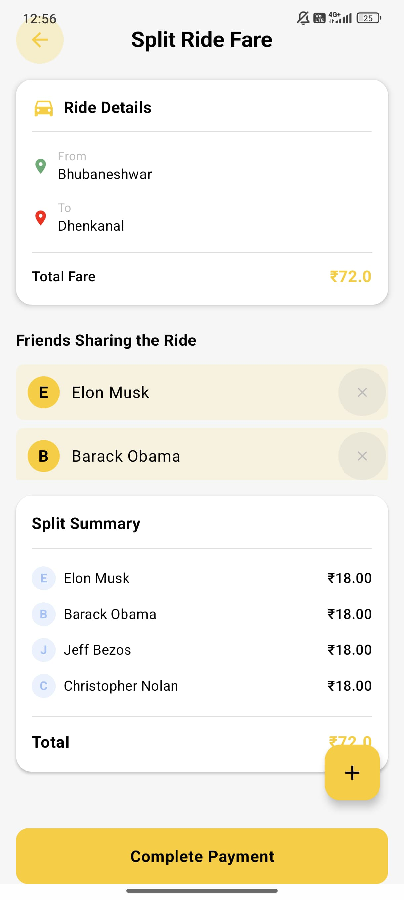</td>
  </tr>
  <tr>
    <td>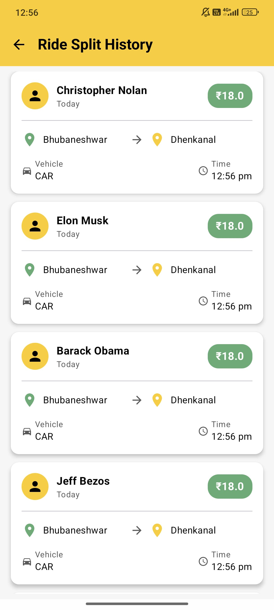</td>
  </tr>
</table>

---

## 🎥 Demo

👉 [Watch Demo Video](https://drive.google.com/file/d/18z5k9uJe2tPK0TQehd7A6G_3dazf3YBz/view?usp=sharing)

---

## 📦 APK

👉 [Download APK](https://drive.google.com/file/d/1H_bVP_q6uNJ2TJFrDG16inGpmb8fMWUc/view?usp=sharing)

---

## 💡 What's Next?

* Integrate Google Maps SDK  
* Add Firebase Auth & backend ride history  
* Real-time fare estimation and partner tracking  
* Razorpay for live payments  

---

## 🔍 Known Limitations

* Auth & payments are mocked  
* No real-time location or maps  

---

Made with ❤ by Amlan
